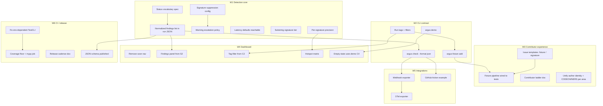

# Dependency map — what connects to what

Read this before picking a story from `PRD.md`. It answers three questions:
1. What must exist before I start?
2. Which files will I touch, and who owns them?
3. Which docs must change in the same PR?

## 1. Workstream graph

**Critical path:** `S1 → S2 → C1`. Nothing downstream (exporters, dashboard findings panel,
JSON schema, GitHub Action) is stable until the run JSON has a documented status vocabulary and
one normalized `findings[]` list. Start here.

## 2. Story → files → owner

| Story | Primary files | Also touches | Owner path? |
|---|---|---|---|
| S1 status vocabulary | `src/argus/models.py`, `docs/` (new `STATUS.md`) | `check.py`, `findings.py`, `README.md` | core (either maintainer) |
| S2 findings list | `models.py` (`RunRecord.findings`), `session.py` finalize, `storage.py` | `website/lib/types.ts`, `CLAUDE.md` key-files table | core |
| S3 suppression | `user_config.py`, `registry.py`, `cli/cmd_stats.py` | `README.md` CLI table | core |
| S4 warning escalation | `check.py`, `session.py` status assignment | `docs/STATUS.md` | core |
| S5 latency defaults | `models.py` `ArgusConfig`, `watcher.py` kwargs | `README.md` Configuration | core |
| S6 substring tier | `registry.py`, `data/signatures.json` | fixture in `fixtures/` | core |
| S9 signature precision | `signature_stats.py`, `feedback_store.py`, `cmd_stats.py` | — | core |
| C1 `check --format json` | `cli/cmd_check.py` | `docs/STATUS.md`, `tests/test_cmd_check.py` | core |
| C2 tags | `watcher.py`, `session.py`, `models.py`, `cmd_show.py`, `cmd_open_ui.py` | `types.ts`, `RunTable.tsx` | core + website |
| C3 `fixture add` | new `cli/cmd_fixture.py`, `fixtures/README.md` | `CONTRIBUTING.md` | core |
| C4 `argus demo` | new `cli/cmd_demo.py`, bundled graph under `src/argus/data/demo/` | `README.md` step 4, `EmptyRunsState.tsx` | core + website |
| X1 fixture→tests | `tests/conftest.py`, new `tests/test_fixtures.py` | `fixtures/README.md` | core |
| X2 ladder | `CONTRIBUTING.md` | `visual/PRD.md` §6 | docs |
| X3 templates | `.github/ISSUE_TEMPLATE/*.yml` | — | **owner-only** (`/.github/`) |
| X4 CODEOWNERS | `.github/CODEOWNERS` | — | **owner-only** |
| D1 remove soon | `website/components/Sidebar.tsx`, `EvaluationBuilder.tsx` | `CONTRIBUTING.md` "Web UI — Planned Pages" | website |
| D2 findings panel | `website/components/run-detail/*`, `types.ts` | — | website |
| D3 tag filter | `RunTable.tsx`, `RunListPanel.tsx` | — | website |
| D4 hotspot matrix | new `components/HotspotMatrix.tsx`, API in `cmd_open_ui.py` | `correlator.py` read-only | core + website |
| D5 empty state | `EmptyRunsState.tsx` | — | website |
| I1 webhook | new `src/argus/exporters/webhook.py`, `session.py` hook | `README.md`, `CLAUDE.md` | core |
| I2 OTel | new `src/argus/exporters/otel.py`, optional dep in `pyproject.toml` | — | core + **owner** (`pyproject.toml`) |
| I3 GH Action | `docs/ci/github-actions.md`, example workflow | `README.md` | docs |
| R1 TestCLI | `tests/test_e2e_langgraph.py` (`sys.executable`) | — | core |
| R2 coverage/mypy | `.github/workflows/ci.yml` | — | **owner-only** |
| R3 release cadence | `CONTRIBUTING.md` Review & Merge | — | docs |
| R4 JSON schema | `docs/schema/run.schema.json`, `storage.py` `schema_version` | `README.md` | core |

## 3. Doc coupling rules (from `CONTRIBUTING.md`, made explicit)

| If a PR changes… | It must also update… |
|---|---|
| Any module added/removed/moved | `CLAUDE.md` key-files table |
| Public API (`ArgusWatcher`, `ArgusSession`, `ArgusConfig`) | `README.md` + `CLAUDE.md` |
| A CLI command or flag | `README.md` CLI block + `argus --help` text |
| Status vocabulary or run JSON shape | `docs/STATUS.md`, `docs/schema/run.schema.json`, `website/lib/types.ts` |
| A detection rule | A fixture in `fixtures/` that the old code misses and the new code catches |
| A parked idea in `good-to-have-dev/` gets built | Delete its doc in the same PR, link the PR from the table |
| A PRD user story lands | Tick its boxes in `visual/PRD.md`, link the PR |

## 4. Boundaries that block contributions

- `cloud/`, `supabase/` — proprietary, PRs closed. Do not reference them from `src/argus/` beyond
  the existing `llm_proxy` fallback.
- `pyproject.toml`, `.github/` — owner approval required. Batch such changes; don't let a
  one-line dep bump hold a feature PR hostage.
- `master` protected; all work via PR; CI (ruff + pytest ×3 Python versions) must pass.
- Adapters for non-LangGraph frameworks: **not open for PRs** until core API is stable
  (PRD non-goal N-2).

## 5. Known stale references (as of 2026-08-30)

| Where | Problem | Fix lives in |
|---|---|---|
| `good-to-have-dev/README.md` "Already shipped" table | Lists `loop_analyzer.py` as shipped; PR #48 deletes it | PR #48 follow-up |
| `README.md` badges/links | Point to `VaradDurge/ARGUS`, repo is `ArgusLabs-ai/ARGUS` | docs PR |
| `README.md` footer | "v0.8.12" while `pyproject.toml` is 0.10.5 | docs PR |
| `.github/ISSUE_TEMPLATE/bug_report.yml` placeholder | "0.8.11" | owner-only |
| `CONTRIBUTING.md` "61 patterns across 6 categories" | `signatures.json` has 72 | docs PR |
| `src/argus/session.py:1434` comment | claims loop analysis | branch `fix/pr48-stale-refs` |
